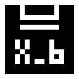

<div align="center">
  
  <h1>B File (Binary File) 二值型文件</h1>
  <p>
    <a href="https://github.com/MoYuStudio/b-file/stargazers"></a>
    <a href="https://github.com/MoYuStudio/b-file/network/members"></a>
    <a href="https://github.com/MoYuStudio/b-file/issues"></a>
    <a href="https://github.com/MoYuStudio/b-file/blob/main/LICENSE"></a>
  </p>
</div>

## 📝 项目简介

BFile是一个专为小型二值化图像开发优化的Python库。它提供了一种高效的压缩格式，特别适合存储和处理二值化的图像和视频数据。

BFile库采用改进的游程编码算法，专为小型二值化图像和视频优化设计，能够实现极高的压缩率。该库最初在资源受限的树莓派Pico Pi 2上开发并优化，其有限的计算资源使其成为测试和验证BFile压缩算法的理想平台。BFile支持多种格式转换，包括PNG到BI、MP4到BV等，并提供base64编码支持，便于网络传输。

由于其极高的压缩率和快速的解码速度，BFile特别适合在资源受限的环境中使用，如嵌入式设备、移动应用或需要快速加载的Web应用。在遮罩图层和开发图层等只需要黑白二值信息的场景中，BFile格式可以显著减少存储空间和传输带宽，提高应用性能。

## 🚀 特性

- ✨ 支持PNG图像与BI格式之间的转换
- 🎥 支持MP4视频与BV格式之间的转换
- 🔄 使用改进的游程编码算法进行数据压缩
- 🔗 支持base64编码转换
- 📊 提供详细的压缩率信息
- 🎯 支持自定义二值化阈值
- ⚙️ 支持视频帧率调整
- 🔌 提供嵌入式设备支持（BFile_Micro）

## 📊 文件格式对比

### BFile.BI图像格式对比

**以下为BFile库中的示例图像文件 (128x128像素的BFile Logo)**

| 特性              | BI               | PNG                | PBM                | JPG                | BMP                |
| ----------------- | ---------------- | ------------------ | ------------------ | ------------------ | ------------------ |
| 文件大小(128x128) | 288 B            | 782 B              | 2,048 B            | 5,888 B            | 65,536 B           |
| 压缩率(对比BMP)   | 99.6%            | 98.8%              | 96.9%              | 90.9%              | 基准               |
| 压缩类型          | 无损             | 无损               | 无损               | 有损               | 无损               |
| 解码速度          | 极快             | 慢                 | 快                 | 慢                 | 快                 |
| 色彩支持          | 仅黑白           | 全彩               | 仅黑白             | 全彩               | 全彩               |
| 透明度            | 不支持           | 支持               | 不支持             | 不支持             | 不支持             |
| 兼容性            | 需要BFile库      | 广泛               | 广泛               | 广泛               | 广泛               |
| 示例文件下载      | [BI](assets/BFile.bi) | [PNG](assets/BFile.png) | [PBM](assets/BFile.pbm) | [JPG](assets/BFile.jpg) | [BMP](assets/BFile.bmp) |

### BFile.BV视频格式对比

**以下为BFile库中的示例视频文件 (128x128像素，8fps的BFile Logo动画)**

| 特性                   | BV               | GIF                | MP4                | MOV      | AVI      |
| ---------------------- | ---------------- | ------------------ | ------------------ | -------- | -------- |
| 文件大小(128x128 8fps) | 916 B            | 4,812 B            | 47,104 B           | 49,152 B | 65,536 B |
| 压缩率(对比AVI)        | 98.6%            | 92.7%              | 28.1%              | 25.0%    | 基准     |
| 压缩类型               | 无损             | 无损               | 有损               | 有损     | 无损     |
| 解码速度               | 极快             | 快                 | 慢                 | 慢       | 快       |
| 色彩支持               | 仅黑白           | 256色              | 全彩               | 全彩     | 全彩     |
| 音频支持               | 不支持           | 不支持             | 支持               | 支持     | 支持     |
| 兼容性                 | 需要BFile库      | 广泛               | 广泛               | 广泛     | 广泛     |
| 示例文件下载           | [BV](assets/BFile.bv) | [GIF](assets/BFile.gif) | [MP4](assets/BFile.mp4) | 暂无     | 暂无     |

## 🛠️ 安装

### 从GitHub安装

```bash
# 克隆仓库
git clone https://github.com/MoYuStudio/b-file.git

# 进入项目目录
cd b-file

# 安装依赖
pip install -r requirements.txt

# 安装库
pip install -e .
```

### 使用pip安装

```bash
pip install b-file
```

## 📖 使用方法

### 图像处理

```python
import BFile

# PNG转BI
BFile.Image.png_to_binary("input.png", "output.bi", threshold=128)

# BI转PNG
BFile.Image.binary_to_png("input.bi", "output.png")

# BI转base64
base64_data = BFile.Image.bi_to_base64("input.bi")

# base64转BI
BFile.Image.base64_to_bi(base64_data, "output.bi")

# 获取压缩信息
info = BFile.Image.get_compression_info("input.bi")
print(f"原始大小: {info['original_size']} 字节")
print(f"压缩后大小: {info['compressed_size']} 字节")
print(f"压缩率: {info['compression_ratio']:.2f}%")
```

### 视频处理

```python
import BFile

# MP4转BV
BFile.Video.mp4_to_bv("input.mp4", "output.bv", threshold=128, target_fps=10)

# BV转MP4
BFile.Video.bv_to_mp4("input.bv", "output.mp4")

# 获取视频信息
info = BFile.Video.get_video_info("input.bv")
print(f"帧数: {info['frame_count']}")
print(f"分辨率: {info['width']}x{info['height']}")
print(f"帧率: {info['fps']}")
```

### 嵌入式设备支持 (BFile_Micro)

BFile_Micro是BFile的嵌入式设备版本，专为资源受限的设备（如树莓派Pico）设计，用于在OLED显示屏上显示BFile格式的图片和视频。

```python
from BFile_Micro import Color, BI, BV

# 初始化OLED驱动（以Pico OLED 1.5寸RGB为例）
from drive.pico_oled_1in5_rgb import OLED_1inch5
oled = OLED_1inch5()

# 清屏
oled.fill(Color.BLACK)
oled.show()

# 显示BI图片
bi = BI(oled)
bi.display_bi_image_centered("logo.bi", scale=1, color=Color.WHITE)

# 播放BV视频
bv = BV(oled)
bv.play_bv_video("animation.bv", scale=1, color=Color.WHITE, loop=3)
```

#### BFile_Micro特性

- 🔌 专为嵌入式设备优化
- 🖥️ 支持多种OLED显示屏
- 🎨 支持自定义颜色显示
- 🔄 支持图片缩放
- 🔁 支持视频循环播放
- ⚡ 极低内存占用

## 📚 API文档

### BFile.Image

- `png_to_binary(png_path, bi_path, threshold=128)`: 将PNG图像转换为BI格式
- `binary_to_png(bi_path, png_path)`: 将BI格式转换为PNG图像
- `bi_to_base64(bi_path)`: 将BI文件转换为base64字符串
- `base64_to_bi(base64_str, bi_path)`: 将base64字符串转换为BI文件
- `get_compression_info(bi_path)`: 获取BI文件的压缩信息

### BFile.Video

- `mp4_to_bv(mp4_path, bv_path, threshold=128, target_fps=10)`: 将MP4视频转换为BV格式
- `bv_to_mp4(bv_path, mp4_path)`: 将BV格式转换为MP4视频
- `get_video_info(bv_path)`: 获取BV文件的视频信息

### BFile_Micro

- `Color`: 颜色常量类，提供常用颜色定义
- `BI`: 图像显示类，用于在OLED上显示BI格式图片
  - `display_bi_image_centered(bi_path, scale=1, color=Color.WHITE)`: 居中显示BI图片
- `BV`: 视频播放类，用于在OLED上播放BV格式视频
  - `play_bv_video(bv_path, scale=1, color=Color.WHITE, loop=1)`: 播放BV视频

## 📋 依赖

- numpy >= 1.19.0
- Pillow >= 8.0.0
- opencv-python >= 4.5.0

## 📁 项目结构

```
b-file/
├── BFile/
│   ├── __init__.py
│   ├── bi.py          # 图像处理模块
│   ├── bv.py          # 视频处理模块
│   └── core.py        # 核心功能模块
├── BFile_Micro/       # 嵌入式设备支持模块
│   ├── __init__.py
│   ├── bi.py          # 嵌入式图像显示模块
│   ├── bv.py          # 嵌入式视频播放模块
│   ├── color.py       # 颜色定义模块
│   └── example.py     # 使用示例
├── tests/              # 测试用例
├── examples/           # 示例代码
├── setup.py            # 安装配置
├── requirements.txt    # 依赖列表
└── README.md           # 本文档
```

## 🤝 贡献

欢迎贡献代码、报告问题或提出改进建议！请查看我们的[贡献指南](CONTRIBUTING.md)了解更多信息。

## 📄 许可证

Apache 许可证 2.0

&copy; 2025 MoYuStudio. All rights reserved.

根据Apache许可证2.0版（"许可证"）授权；
除非符合许可证，否则不得使用此文件。
您可以在以下位置获取许可证副本：

    http://www.apache.org/licenses/LICENSE-2.0

除非适用法律要求或书面同意，否则根据许可证分发的软件是基于
"按原样"提供的，没有任何明示或暗示的保证或条件。
有关许可证下的特定语言管理权限和
限制，请参阅许可证。
