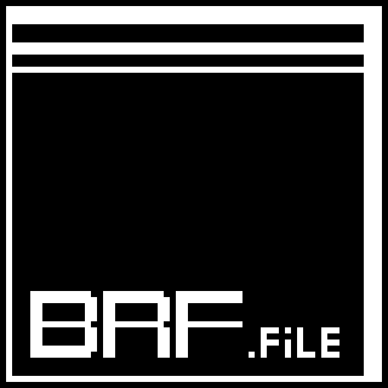

<div align="center">
  
</div>

# BRF (Binary Run-length File)

BRF是一个用于处理二值化图像和视频的Python库。它提供了一种高效的压缩格式，特别适合存储二值化的图像和视频数据。

## 项目简介

BRF库使用改进的游程编码算法，专门针对二值化图像和视频进行优化，可以实现极高的压缩率。该库支持多种格式转换，包括PNG到BRF、MP4到BV等，并提供base64编码支持，方便网络传输。

**特别说明**: 本库最初是在树莓派Pico Pi 2上开发的，并且在Pico Pi 2上运行效果最佳。Pico Pi 2的有限资源使其成为测试和验证BRF压缩算法的理想平台，能够有效处理二值化图像和视频数据。

## 文件格式对比

### 图像文件格式对比

| 特性              | BI        | PBM    | PNG      | JPG      | BMP      |
| ----------------- | --------- | ------ | -------- | -------- | -------- |
| 实际大小(128x128) | 0.8 KB    | 2 KB   | 1.2 KB   | 0.9 KB   | 16 KB    |
| 压缩率(对比BMP)   | 95%       | 87.5%  | 92.5%    | 94.4%    | 基准     |
| 文件大小          | 极小      | 小     | 中等     | 小       | 大       |
| 压缩率            | 极高      | 高     | 中等     | 高       | 低       |
| 处理速度          | 极快      | 快     | 中等     | 快       | 慢       |
| 二值化支持        | 原生      | 原生   | 需要转换 | 需要转换 | 需要转换 |
| 色彩支持          | 仅黑白    | 仅黑白 | 全彩     | 全彩     | 全彩     |
| 透明度            | 不支持    | 不支持 | 支持     | 不支持   | 不支持   |
| 兼容性            | 需要BRF库 | 广泛   | 广泛     | 广泛     | 广泛     |

### 视频文件格式对比

| 特性                        | BV        | MP4      | MOV      | AVI      |
| --------------------------- | --------- | -------- | -------- | -------- |
| 实际大小(10s,10fps,128x128) | 80 KB     | 150 KB   | 100 KB   | 3000 KB  |
| 压缩率(对比AVI)             | 97.3%     | 95.0%    | 96.7%    | 基准     |
| 文件大小                    | 极小      | 小       | 小       | 大       |
| 压缩率                      | 极高      | 高       | 高       | 中等     |
| 处理速度                    | 极快      | 快       | 快       | 中等     |
| 二值化支持                  | 原生      | 需要转换 | 需要转换 | 需要转换 |
| 色彩支持                    | 仅黑白    | 全彩     | 全彩     | 全彩     |
| 音频支持                    | 不支持    | 支持     | 支持     | 支持     |
| 兼容性                      | 需要BRF库 | 广泛     | 广泛     | 广泛     |

## 本地安装

由于这是一个本地库，您需要将代码克隆到本地并安装：

```bash
# 克隆仓库
git clone https://github.com/MoYuStudio/BRF.git

# 进入项目目录
cd BRF

# 安装依赖
pip install -r requirements.txt

# 安装库
pip install -e .
```

## 特性

- 支持PNG图像与BRF格式之间的转换
- 支持MP4视频与BV格式之间的转换
- 使用改进的游程编码算法进行数据压缩
- 支持base64编码转换
- 提供详细的压缩率信息
- 支持自定义二值化阈值
- 支持视频帧率调整

## 使用方法

### 图像处理

```python
import BRF

# PNG转BRF
BRF.Image.png_to_binary("input.png", "output.bi", threshold=128)

# BRF转PNG
BRF.Image.binary_to_png("input.bi", "output.png")

# BRF转base64
base64_data = BRF.Image.bi_to_base64("input.bi")

# base64转BRF
BRF.Image.base64_to_bi(base64_data, "output.bi")

# 获取压缩信息
info = BRF.Image.get_compression_info("input.bi")
print(f"原始大小: {info['original_size']} 字节")
print(f"压缩后大小: {info['compressed_size']} 字节")
print(f"压缩率: {info['compression_ratio']:.2f}%")
```

### 视频处理

```python
import BRF

# MP4转BV
BRF.Video.mp4_to_bv("input.mp4", "output.bv", threshold=128, target_fps=10)

# BV转MP4
BRF.Video.bv_to_mp4("input.bv", "output.mp4")

# 获取视频信息
info = BRF.Video.get_video_info("input.bv")
print(f"帧数: {info['frame_count']}")
print(f"分辨率: {info['width']}x{info['height']}")
print(f"帧率: {info['fps']}")
```

## API文档

### BRF.Image

- `png_to_binary(png_path, bi_path, threshold=128)`: 将PNG图像转换为BRF格式
- `binary_to_png(bi_path, png_path)`: 将BRF格式转换为PNG图像
- `bi_to_base64(bi_path)`: 将BRF文件转换为base64字符串
- `base64_to_bi(base64_str, bi_path)`: 将base64字符串转换为BRF文件
- `get_compression_info(bi_path)`: 获取BRF文件的压缩信息

### BRF.Video

- `mp4_to_bv(mp4_path, bv_path, threshold=128, target_fps=10)`: 将MP4视频转换为BV格式
- `bv_to_mp4(bv_path, mp4_path)`: 将BV格式转换为MP4视频
- `get_video_info(bv_path)`: 获取BV文件的视频信息

## 依赖

- numpy >= 1.19.0
- Pillow >= 8.0.0
- opencv-python >= 4.5.0

## 项目结构

```
BRF/
├── BRF/
│   ├── __init__.py
│   ├── bi.py          # 图像处理模块
│   ├── bv.py          # 视频处理模块
│   └── core.py        # 核心功能模块
├── tests/              # 测试用例
├── examples/           # 示例代码
├── setup.py            # 安装配置
├── requirements.txt    # 依赖列表
└── README.md           # 本文档
```

## 开发计划

- [ ] 添加更多图像格式支持
- [ ] 优化压缩算法
- [ ] 添加GUI界面
- [ ] 提供更多示例和教程

## 许可证

Apache License 2.0

Copyright 2023 MoYuStudio

Licensed under the Apache License, Version 2.0 (the "License");
you may not use this file except in compliance with the License.
You may obtain a copy of the License at

    http://www.apache.org/licenses/LICENSE-2.0

Unless required by applicable law or agreed to in writing, software
distributed under the License is distributed on an "AS IS" BASIS,
WITHOUT WARRANTIES OR CONDITIONS OF ANY KIND, either express or implied.
See the License for the specific language governing permissions and
limitations under the License.
